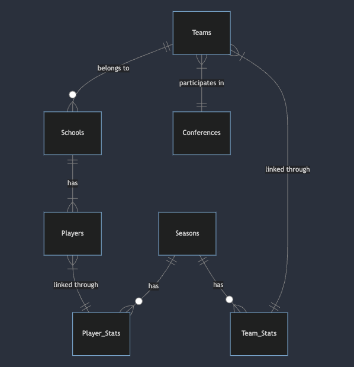

# Design Document

By AUSTIN ZEHNDER

Video overview: <https://youtu.be/5LZxtkJzx0cE>

## Scope

College basketball is one of the greatest sports showcases in the world. I wanted to create an easy-to-use database for all inquiries NCAA Division 1 basketball-related

* Purpose: To store data on college basketball players, teams, schools, conferences, and seasons to support common queries and analysis
* In scope: Division 1 college basketball players and teams
* Out of scope: Other sports or NCAA divisions (NAIA, etc.)

## Functional Requirements

This database will support:

* The database should support:
    Retrieving player stats over time
    Analyzing team performance by season
    Identifying player rankings by stat
    Viewing school and conference affiliations
    Restricting edit access to key tables to prevent unintended changes
* Out of scope:
    Storing data on other college sports
    Real-time stats

## Representation

### Entities

* Key entities include:
    Players - id, first_name, last_name
    Schools - id, name, location
    Conferences - id, name
    Teams - id, name, mascot, school_id (FK to schools), conference_id (FK to conferences)
    Seasons - id, year
    Player_stats - id, player_id (FK to players table), season_id (FK to seasons), points, rebounds, assists
    Team_stats - id, team_id (FK to teams), season_id (FK seasons), points, rebounds
* Used integers for id fields, text for names/location, and integers for stats numbers.
* Used foreign keys to link related records across tables.

### Relationships

    Teams ||--o{ Schools : "belongs to"
    Teams }|--|| Conferences : "participates in"
    Schools ||--|{ Players : "has"
    Seasons ||--o{ Player_Stats : "has"
    Seasons ||--o{ Team_Stats : "has"
    Players }|--|| Player_Stats : "linked through"
    Teams }|--|| Team_Stats : "linked through"

## Optimizations

* Added indexes on players.last_name and players.first_name to improve search performance
* Included team_id and school_id foreign keys in player_stats to allow joining tables without going via players table

## Limitations

* Only stores men's Division 1 basketball focused data
* Does not allow representation of individual game stats, schedule data
* No audit tracking for changes over time
